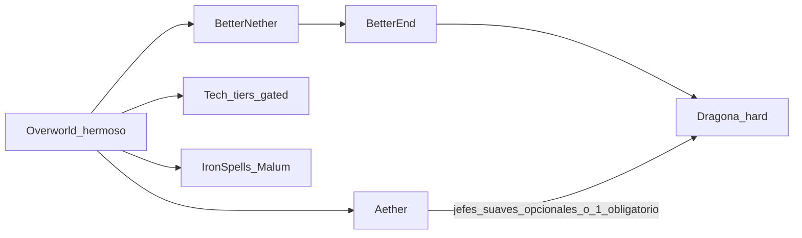

<!-- 0c39f076-7d44-49af-9dad-e2bfa963ba28 -->
---
todos:
- id: "scaffold-instances"
  content: "Crear instancias NeoForge 1.21.1 client/server + Java 21 + docs PACK.md"
  status: completed
- id: "perf-ftb-qol"
  content: "Instalar performance, FTB Teams/Chunks/Quests y QoL base; validar arranque en 6GB"
  status: completed
- id: "overworld-stack"
  content: "Montar Terralith+Tectonic+BWG+estructuras+fauna+deco; test exploracion"
  status: completed
- id: "dimensions"
  content: "Anadir Aether + BetterNether/End New Dawn; verificar portales y estabilidad"
  status: completed
- id: "tech-gates"
  content: "Anadir Create→IE→Mekanism→AE2 con KubeJS/CraftTweaker gates + quests tech"
  status: completed
- id: "magic-dragon-quests"
  content: "Anadir Iron’s+Malum, dragona hard (questbook FTB en fase dedicada)"
  status: completed
- id: "kubejs-craft-mods"
  content: "Modificaciones de crafteos KubeJS (balance, BBQ, loot, gates refinados)"
  status: completed
- id: "ftb-quests-missions"
  content: "Crear misiones FTB Quests (capítulos cozy/tech/dimensiones/dragona)"
  status: completed
- id: "curseforge-profile"
  content: "Generar perfil/manifest CurseForge + docs de instalacion en CurseForge App"
  status: completed
- id: "github-repo"
  content: "Repo GitHub (configs, scripts, perfiles CF); .gitignore sin mods/jars/worlds"
  status: completed
  isProject: false
---
# Plan: Oasis (NeoForge 1.21.1)

## Decisiones cerradas

| Area | Decision |
|---|---|
| Nombre | **Oasis** (pack + servidor + carpeta del proyecto) |
| Carpeta workspace | `D:\DATOS USUARIO\Documentos\Servidores Minecraft\Oasis` (antes `Nuevo`) |
| Plataforma | NeoForge + Minecraft **1.21.1** + Java 21 |
| Fuente de mods | **Solo CurseForge** (descargas, deps y versiones; no Modrinth como fuente) |
| Distribucion jugadores | **Perfil / zip CurseForge** (manifest con projectId+fileId); instalacion via CurseForge App |
| Control de versiones | **GitHub**: configs, scripts KubeJS, quests, perfiles/manifest CF, docs — **nunca jars de mods** |
| Pregen | **No** en este workspace (no es el servidor final). Chunky queda instalado para usarlo solo en el host definitivo |
| Tono | Cozy adventure: explorar/construir primero; combate selectivo |
| Inventario | **Sophisticated Backpacks** + **Sophisticated Storage** (+ Sophisticated Core) |
| Cofres multiplayer | **Lootr** (per-player) |
| Armas | **Simply Swords** |
| Armaduras | **Immersive Armors** |
| Jugadores | Max 5 |
| Cliente | Fluido con **≤6 GB** RAM asignada |
| Server | Host dedicado final, hasta **16 GB** (usar ~10–12 GB JVM); MOTD/nombre **Oasis** |
| Tech | Progresiva con gates: tiers antiguos obligatorios antes de modernos |
| Magia | **Iron’s Spells ’n Spellbooks** + **Malum** (paralela a tech, no la bloquea) |
| Dimensiones | **BetterNether: New Dawn** + **BetterEnd: New Dawn** + **The Aether** |
| Social | FTB Teams + FTB Chunks + FTB Quests |
| Quests | Checklist opcional en cozy/exploración; **gates reales en tech** |
| Jefes | Pocos; algunos obligatorios; **Ender Dragon pelea exigente** |
| Overworld | Pilar #1: biomas hermosos, deco alta, fauna por bioma |
| Cocina | Pilar cozy fuerte: **carnita asada / BBQ** vía Farmer’s Delight + addons |

## Filosofia del pack

- Cada minuto en el Overworld debe sentirse distinto: terreno, vegetacion, fauna, estructuras y bloques de construccion.
- La casa/farming/cocina (especialmente asados y reuniones) es tan valida como la fabrica.
- La tech es el camino largo y estructurado; la magia es poder/utilidad paralelo.
- No expert-gated en cocina/deco/exploracion; si en maquinaria avanzada.

## Cupo de mods (presupuesto 6 GB)

**Tope duro: 160 mods** (libs y addons cuentan; client-only tambien). La lista v1 es intercambiable: se pueden **cambiar** mods, no pasar de 160.

Cupos orientativos (suman ~160):

- Mundo / estructuras / Overworld: 28–32
- Cozy / farming / deco / fauna: 38–42
- Tech + libs: 28–32
- Magia: 8–10
- Dimensiones + combate/jefes: 14–16
- FTB + QoL + performance: 28–32

Regla de sustitucion: si entra un mod nuevo, sale otro de igual categoria. Prioridad al recortar bajo presion: deco Macaw/Let’s Do addons → bosses opcionales (Cataclysm) → estructuras pesadas. Nunca recortar Terralith/Tectonic/BWG antes que deco.

## Nucleo de contenido (v1)

### 1) Overworld “vale la pena explorar” (prioridad maxima)

**Terreno y biomas (combo elegido, no apilar mas biomas):**
- **Terralith** (mod NeoForge) — biomas vanilla mejorados + ~95 biomas
- **Tectonic** (version mod, compatible con Terralith) — relieve dramatico
- **Oh The Biomes We’ve Gone** + Terrablender + Oh The Trees You’ll Grow — biomas lush + sets de bloques de construccion
- No anadir Regions Unexplored / Biomes O’ Plenty en v1 (solapan bioma space; 6 GB no arregla conflictos de worldgen)

**Estructuras (exploracion cada pocos minutos):**
- YUNG’s Better series (caves, nether, end, dungeons, strongholds, ocean monuments, mineshafts — las que esten estables en 1.21.1 NeoForge)
- ChoiceTheorem’s Overhauled Village
- Towns and Towers
- When Dungeons Arise (incluido en v1; recortar solo si el test de exploracion va mal)

**Fauna:**
- **Alex’s Mobs Continued** (+ deps: CodxLib) como fauna principal por bioma
- AmbientSounds / Presence Footsteps (cliente) para atmosfera
- Opcional v1 si cabe tras test: **Naturalist** (fauna cozy extra); nunca Better Animals Plus encima de ambos

**Cozy / deco / farming + carnita asada (prioridad alta dentro del cupo 160):**

Pilar cocina BBQ (v1 fijo):
- **Farmer’s Delight** (base)
- **Barbeque’s Delight** — parrilla, brochetas, condimentos (el mod “carnita asada”)
- **Brewin’ and Chewin’** — keg, fermentados, quesos/bebidas para la reunión
- **My Nether’s Delight** — cocina del Nether (hotdogs/hoglin, etc.)
- +1–2 addons FD estables en 1.21.1 NeoForge al montar (p.ej. Cultural Delights u Ocean’s Delight **solo si** hay build NeoForge 1.21.1)

Resto cozy/deco:
- Let’s Do: Bakery, Meadow, Farm & Charm, Candlelight (4; el resto solo por sustitucion)
- Macaw’s: Doors, Bridges, Roofs, Windows, Furniture (5)
- **Chipped + Rechiseled**
- Beautify, Another Furniture, Handcrafted
- Create Deco cuando entre Create

Nota de cupo: la cocina BBQ manda sobre deco extra; si hay que recortar, sale un Macaw/Let’s Do antes que Barbeque’s Delight.

**Combate / gear (v1 fijo, via CurseForge):**
- **Simply Swords** — variedad de armas (katana, glaive, hammer, etc.) sin volverse expert
- **Immersive Armors** — sets de armadura visuales y vanilla-friendly
- Deps que pida CurseForge al instalar (p.ej. Simply Swords libs si aplica)

### 2) Tech progresiva (gates obligatorios)

Cadena fija v1 (actualizada):

1. **Create** (+ addons ligeros: Encased, Deco, Crafts & Additions si caben)
2. **Immersive Engineering**
3. **Applied Energistics 2** — almacenamiento / auto digital (antes de Mek)
4. **Mekanism** (+ Generators) — endgame tech

Implementacion de gates:
- KubeJS modifica recetas **existentes** (crafting + máquinas); mismos recipe id → JEI
- Sin items nuevos del pack; integración cruzada Create/IE/AE2/Mek
- Documentado en `docs/TECH_PROGRESSION.md` (brief FTB Quests)
- FTB Quests capitulo Tech con dependencias por tier

Regla de diseno: farming/deco/magia **no** requieren Mekanism; solo la linea industrial avanzada.

### 3) Magia suave

- Iron’s Spells ’n Spellbooks (+ curios/accessories stack que use el pack)
- Malum
- Sin Ars Nouveau en v1 (ahorra peso y overlap)

### 4) Dimensiones y bosses

- The Aether (dungeons; **1 boss de Aether obligatorio** via quest, el resto opcional)
- BetterNether: New Dawn
- BetterEnd: New Dawn
- Dragon fight: mod de pelea mejorada (p.ej. Dragon enhancements / End Remastered eyes + config de fase dura) + quest gate “preparacion dragona”
- Incluir **L_Ender’s Cataclysm** en v1 como jefes extras **opcionales** (no gatean tech ni cozy); candidato #1 a salir si el conteo supera 160 o el cliente aprieta

### 5) Social / QoL / performance

**FTB:** Library, Teams, Chunks, Quests (+ Quests compatibility si hace falta)

**QoL:** Waystones, **Sophisticated Backpacks** + **Sophisticated Storage** (+ Core), **Lootr**, JourneyMap o FTB Chunks map, AppleSkin, Jade, JEI

**Fuente:** todas las jars desde CurseForge (mismo game version 1.21.1 + loader NeoForge).

**Performance (obligatorio):**
- Cliente: Embeddium/Sodium NeoForge, Entity Culling, ImmediatelyFast, FerriteCore, ModernFix
- Server: Lithium, FerriteCore, ModernFix, Chunky (solo en servidor final; **sin pregen aqui**), Structure Layout Optimizer
- RAM cliente recomendada en launcher: **6144 MB** (6 GB); server JVM: **10–12G** de los 16

## Capitulos FTB Quests (estructura)

1. Bienvenida a Oasis / checklist cozy (opcional)
2. Casa y cocina / carnita asada (opcional; rewards comida/parrilla)
3. Exploracion Overworld (opcional, rewards deco/food)
4. Aether (1 objetivo obligatorio de dungeon/boss; resto opcional)
5. Tech I Create (obligatorio para Tech II)
6. Tech II Immersive (obligatorio para AE2)
7. Tech III AE2 storage (obligatorio para Mek)
8. Tech IV Mekanism (endgame)
9. Magia Iron’s / Malum (paralelo, opcional)
10. Nether / End prep
11. Dragona (obligatorio de “cierre aventura”)

## Repo GitHub (que si / que no)

**Subir:**
- `kubejs/` (scripts y assets del pack)
- configs relevantes del pack (`config/` seleccionadas; sin secretos)
- FTB Quests (`config/ftbquests/` o datapack/quests segun layout)
- perfil CurseForge: `manifest.json`, `modlist.html`, overrides (configs/scripts)
- docs: `PACK.md`, `mods-core.md`, `docs/INSTALL.md`, `plan.md`
- `.gitignore`, README corto de instalacion

**No subir nunca:**
- `**/mods/**/*.jar` ni caches de libs del installer
- mundos (`world/`, saves), `logs/`, `crash-reports/`
- `libraries/`, installer NeoForge pesado si se puede regenerar
- `options.txt` personales, tokens, `ops.json` con UUIDs si no se desean publicos

El workspace local sigue teniendo `client/mods` y `server/mods` para desarrollo y smoke tests; solo quedan fuera de Git.

## Perfil CurseForge e instalacion

### Generacion (fase dedicada)
1. Construir `curseforge/manifest.json` (Minecraft 1.21.1, NeoForge 21.1.253, lista `files[]` con `projectID` + `fileID` de cada mod CurseForge).
2. `overrides/` con lo que el App debe copiar tras descargar mods: `kubejs/`, configs del pack, quests, etc. (**sin** carpeta `mods` con jars).
3. Empaquetar zip importable: `Oasis-<version>.zip` = `manifest.json` + `modlist.html` + `overrides/`.
4. Documentar en `docs/INSTALL.md` los pasos exactos en CurseForge App.

### Como se instala (jugadores / esposa / amigas)
1. Tener **CurseForge App** + **Java 21**.
2. Importar el zip del perfil **Oasis** (o instalar el modpack publicado en CurseForge si se sube alli).
3. La App descarga todos los mods desde CurseForge segun el manifest (no hace falta pasar jars a mano).
4. Asignar **6144 MB** RAM a la instancia.
5. Jugar / conectar al IP del servidor final cuando exista.

### Servidor final (otro host, mas adelante)
- Misma lista de mods (sin client-only) + mismos overrides (`kubejs`, configs, quests).
- Pregen con Chunky **solo alli**, no en este PC de desarrollo.

## Entregables en el workspace

Carpeta del proyecto: [`D:\DATOS USUARIO\Documentos\Servidores Minecraft\Oasis`](D:\DATOS USUARIO\Documentos\Servidores Minecraft\Oasis)

1. `PACK.md` — vision Oasis, reglas, tono, RAM, decisiones
2. `mods-core.md` — lista v1 por categoria (nombre + rol + lado client/server) con conteo ≤160
3. Estructura de instancias:
    - `client/` (desarrollo local + base del perfil CF)
    - `server/` (smoke tests locales; no es el host final)
4. Configs clave + KubeJS + FTB Quests
5. `curseforge/` — manifest + overrides + zip de perfil
6. Repo GitHub con lo versionable (sin mods)

## Orden de ejecucion

1. Congelar plataforma (NeoForge 21.1.x estable) y crear instancias client/server vacias — **hecho**
2. Instalar performance + FTB + QoL base; verificar arranque en 6 GB — **hecho**
3. Anadir Overworld stack; test exploracion — **hecho**
4. Anadir Aether + BetterNether + BetterEnd — **hecho**
5. Anadir Create → IE → Mekanism → AE2; gates KubeJS base — **hecho**
6. Anadir Iron’s + Malum + dragona hard (+ Cataclysm) — **hecho**
7. **Fase KubeJS — modificaciones de crafteos:** balance BBQ/cocina, ajustes loot si hace falta, refinamiento de gates tech, tweaks de progresión. Entregable: scripts en `kubejs/` documentados.
8. **Fase FTB Quests — crear misiones:** capítulos cozy/tech/dimensiones/dragona. Entregable: questbook jugable.
9. **Fase perfil CurseForge:** generar `manifest.json` + overrides + zip; documentar instalacion en CurseForge App.
10. **Fase GitHub:** repo con configs/scripts/perfiles/docs; `.gitignore` excluye mods/mundos/logs; push inicial.

**Fuera de alcance aqui:** pregen Chunky y despliegue en el servidor final (otro entorno).

## Criterios de exito

- Cliente estable ~6 GB explorando biomas densos sin shaders
- **Total de mods ≤ 160** en client y server (server sin client-only, mismo techo de contenido)
- No se puede saltar Create→IE→AE2→Mekanism; storage AE2 antes del endgame Mek
- Dragona notablemente mas dificil que vanilla
- Amigas pueden jugar cozy sin tocar tech gates
- Instalacion de jugadores via **perfil CurseForge** (sin pasar carpeta `mods` a mano)
- GitHub versiona configs/scripts/perfiles; **cero jars de mods** en el remoto
